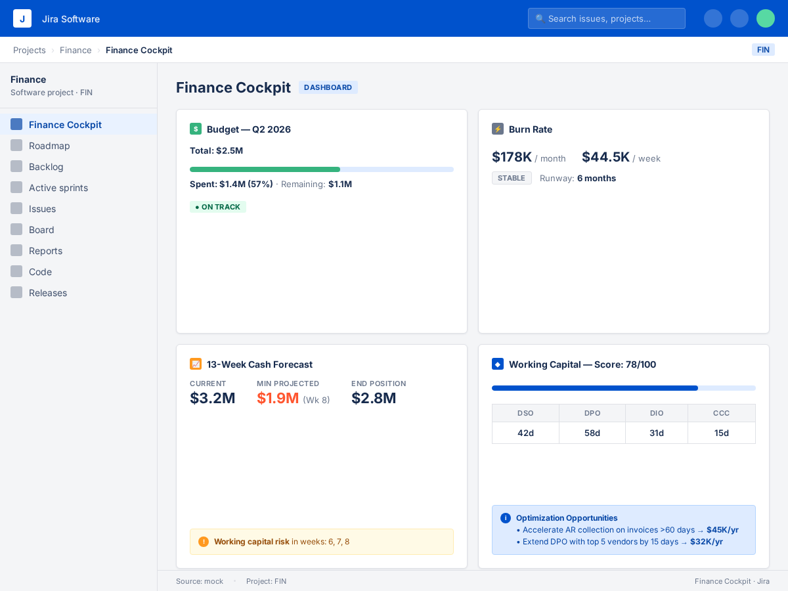

# Finance Cockpit

> CFO-grade financial dashboard for Jira — budget tracking, burn rate analysis, 13-week cash forecasting, and working capital optimization. Powered by CockroachDB.



---

## Overview

**Finance Cockpit** is a Jira Project Page app that gives engineering, product, and finance teams a real-time view of organizational financial health directly inside Jira. Instead of switching between spreadsheets and BI tools, stakeholders can monitor budget utilization, burn rate trends, cash flow projections, and working capital efficiency from the same interface they use to manage sprints and epics.

The dashboard aggregates financial data from CockroachDB databases — including budgets, cash flow forecasts, CFO briefs, and working capital metrics — through a three-tier fallback architecture. Live proxy data flows through Forge's key-value cache with a 5-minute TTL, and rich mock data ensures the gadget remains fully operational even during outages or initial setup.

### Key Features

| Feature | Description |
|---------|-------------|
| **Budget Tracking** | Period-based budget vs. actual spend with progress bar visualization, percentage utilization, and color-coded status badges (Healthy / On Track / Over Budget Risk) |
| **Burn Rate Analysis** | Monthly and weekly burn rate calculations with trend indicators (stable / increasing / decreasing) and automatic runway estimation in months |
| **13-Week Cash Forecast** | Rolling 13-week cash position projection showing current balance, minimum projected balance (with week identification), end position, and working capital risk week callouts |
| **Working Capital Score** | Composite 0–100 score based on Days Sales Outstanding (DSO), Days Payable Outstanding (DPO), Days Inventory Outstanding (DIO), and Cash Conversion Cycle (CCC) |
| **Optimization Recommendations** | Actionable suggestions for working capital improvement with estimated annual savings amounts (e.g., "Accelerate AR collection → $45K/yr") |
| **Context-Aware** | Automatically detects the Jira project key and displays it, so stakeholders know which project context the financials relate to |
| **Source Transparency** | Footer indicator showing data source (proxy / cache / mock) for debugging and trust |
| **Three-Tier Data Fallback** | CockroachDB REST Proxy → Forge KVS Cache (5-min TTL) → Rich Mock Data — zero-downtime guarantee |
| **Webtrigger Ingestion** | POST webhook endpoint for pushing financial data updates from ERP systems, FP&A tools, or custom pipelines |

---

## Architecture

```
┌───────────────────────────────────────────────────────────────┐
│                    Jira Project — FIN                          │
│  ┌─────────────────────────────────────────────────────────┐  │
│  │              Finance Cockpit Panel                       │  │
│  │           (Custom UI — @forge/ui)                       │  │
│  │  ┌──────────────┐  ┌──────────────┐                     │  │
│  │  │   Budget     │  │  Burn Rate   │                     │  │
│  │  │   Tracking   │  │  Analysis    │                     │  │
│  │  ├──────────────┤  ├──────────────┤                     │  │
│  │  │  13-Week     │  │  Working     │                     │  │
│  │  │  Cash Forecast│  │  Capital    │                     │  │
│  │  └──────────────┘  └──────────────┘                     │  │
│  └─────────────────────────┬───────────────────────────────┘  │
│                            │ resolver (src/index.js)          │
│                            ▼                                  │
│  ┌─────────────────────────────────────────────────────────┐  │
│  │              Three-Tier Data Layer                       │  │
│  │  Tier 1: CockroachDB REST Proxy (/api/finance-cockpit)  │  │
│  │  Tier 2: Forge KVS Cache (@forge/kvs, 5-min TTL)        │  │
│  │  Tier 3: Embedded Mock Data (always available)           │  │
│  └─────────────────────────────────────────────────────────┘  │
│                            ▲                                  │
│                            │ webtrigger (POST)                │
│  ┌─────────────────────────┴───────────────────────────────┐  │
│  │              CockroachDB Data Sources                    │  │
│  │  • closed_loop_finance (budgets, forecasts, evidence)    │  │
│  │  • multi_agent_cfo_os (briefs, forecasts)                │  │
│  │  • working_capital_optimizer (DSO, DPO, DIO, CCC)        │  │
│  │  • cash_flow_optimizer (13-week projections)              │  │
│  └─────────────────────────────────────────────────────────┘  │
└───────────────────────────────────────────────────────────────┘
```

---

## Data Sources

Finance Cockpit aggregates financial data from CockroachDB databases:

| Database | Tables Used | Description |
|----------|-------------|-------------|
| `closed_loop_finance` | `budgets`, `cash_flow_forecasts`, `evidence` | Budget allocations, rolling cash forecasts, financial evidence and findings |
| `multi_agent_cfo_os` | `cfo_briefs`, `forecasts` | AI-generated CFO briefs, financial projections and scenarios |
| `working_capital_optimizer` | Working capital metrics (DSO, DPO, DIO, CCC) | Days Sales/Payable/Inventory Outstanding, Cash Conversion Cycle |
| `cash_flow_optimizer` | Cash flow projection tables | 13-week rolling cash position forecasts |

---

## Installation

### Prerequisites

- [Node.js](https://nodejs.org/) 20+ (LTS)
- [Forge CLI](https://developer.atlassian.com/platform/forge/getting-started/) v10+
- An Atlassian developer account with API token
- (Optional) A running [db-proxy](https://github.com/icohangar-ops/db-proxy) instance for live CockroachDB data

### Quick Start

```bash
# 1. Clone the repository
git clone https://github.com/icohangar-ops/finance-cockpit.git
cd finance-cockpit

# 2. Install dependencies
npm install

# 3. Authenticate with Forge
forge login

# 4. Deploy to development
forge deploy

# 5. Install on your Jira site
forge install --site <your-site>.atlassian.net --product jira
```

### Configuring the Data Proxy

To connect to live CockroachDB financial data, update the proxy URL in `src/index.js`:

```javascript
// src/index.js — line 28
const response = await fetch('https://your-proxy-url.com/api/finance-cockpit', {
```

And update `manifest.yml`:

```yaml
permissions:
  external:
    fetch:
      backend:
        - "https://your-proxy-url.com"
```

Redeploy after changes:

```bash
forge deploy
```

Without a proxy, Finance Cockpit serves comprehensive mock data representing a $2.5M quarterly budget with realistic burn rates and working capital metrics.

---

## Usage

### Accessing in a Jira Project

1. Navigate to a Jira Project
2. In the left sidebar, click **Project pages** (or **Apps** → **Project pages**)
3. Select **Finance Cockpit** from the available project pages
4. The dashboard loads with four panels in a grid layout

### Reading the Dashboard Panels

#### Budget Panel
- **Green badge (Healthy)**: Under 70% spent — plenty of runway remaining
- **Amber badge (On Track)**: 70–90% spent — monitor closely
- **Red badge (Over Budget Risk)**: Over 90% spent — immediate attention required

#### Burn Rate Panel
- **Runway**: Number of months before remaining budget is exhausted at current spend rate
- **Trend**: Whether monthly spend is stable, increasing (amber), or decreasing (green)

#### Cash Forecast Panel
- **Min Projected**: The lowest expected cash balance in the 13-week window
- **Risk Weeks**: Weeks where working capital constraints could cause cash shortfalls
- **Yellow warning** appears when working capital risk is detected

#### Working Capital Panel
- **DSO** (Days Sales Outstanding): Lower is better — faster invoice collection
- **DPO** (Days Payable Outstanding): Higher is better — longer time to pay vendors
- **DIO** (Days Inventory Outstanding): Lower is better — faster inventory turnover
- **CCC** (Cash Conversion Cycle = DSO - DPO + DIO): Lower is better — faster cash recovery

### Webtrigger (External Data Push)

```bash
curl -X POST "https://<webtrigger-url>" \
  -H "Content-Type: application/json" \
  -d '{
    "budget": { "total": 2500000, "spent": 1420000, "remaining": 1080000, "period": "Q2 2026" },
    "burnRate": { "monthly": 178000, "weekly": 44500, "trend": "stable", "runwayMonths": 6 },
    "cashForecast": { "currentBalance": 3200000, "minProjected": 1850000, "minWeek": 8, ... },
    "workingCapital": { "dso": 42, "dpo": 58, "dio": 31, "ccc": 15, "score": 78, ... }
  }'
```

---

## Project Structure

```
finance-cockpit/
├── manifest.yml               # Forge app manifest (modules, permissions, resources)
├── package.json               # Dependencies (@forge/ui, @forge/api, @forge/kvs)
├── src/
│   ├── index.js               # Backend resolver — three-tier data fetch + cache
│   ├── webhook.js             # Webtrigger handler — POST data ingestion
│   ├── frontend/
│   │   ├── index.html         # Custom UI HTML shell
│   │   └── index.jsx          # Custom UI React component (4-panel dashboard)
│   └── webhook-fn/
│       └── index.js           # Webtrigger function entry point
└── docs/
    └── finance-cockpit-screenshot.png
```

---

## Technical Details

- **Runtime**: Node.js 24.x (Forge-managed)
- **UI Framework**: `@forge/ui` Custom UI with `Dashboard` and `DashboardPanel` layout components
- **Storage**: `@forge/kvs` (Forge Key-Value Store) — 5-minute TTL cache
- **HTTP Client**: `@forge/api` `fetch` (Forge's secure, permission-gated HTTP client)
- **Module Type**: `jira:projectPage`
- **Scopes**: `read:jira-work`, `storage:app`
- **Permissions**: `external:fetch` to backend proxy URL

---

## Related Repositories

| Repository | Description |
|------------|-------------|
| [market-radar](https://github.com/icohangar-ops/market-radar) | Market sentiment + Fed policy dashboard (Jira Dashboard Gadget) |
| [decision-brief](https://github.com/icohangar-ops/decision-brief) | CFO decision briefs with adversarial rounds (Jira Project Page) |
| [db-proxy](https://github.com/icohangar-ops/db-proxy) | CockroachDB REST proxy serving all Forge apps |

---

## License

Private repository. All rights reserved.

## Demo

[](docs/media/finance-cockpit-demo.mp4)

📺 [Watch the demo](demos/$(basename "$video")) — slide-style walkthrough of key features and usage.
